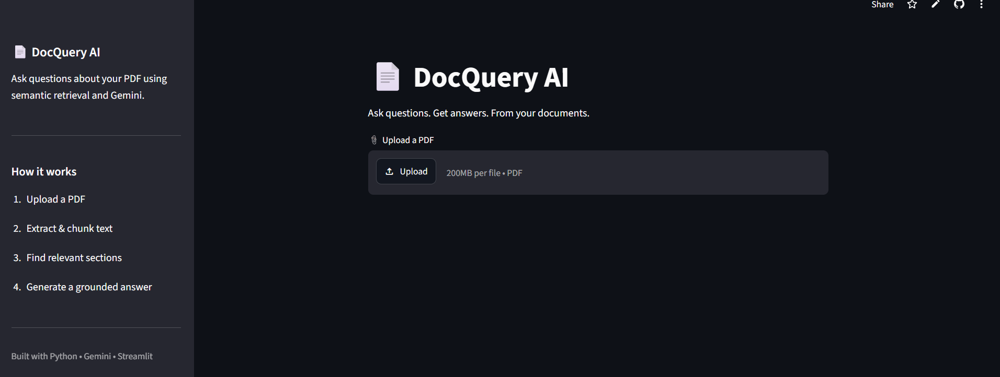

# 📄 DocQuery AI

**AI-powered PDF question answering using Retrieval-Augmented Generation (RAG).**

## 🚀 Live Demo

[Try DocQuery AI](https://docqueryai2.streamlit.app/)

DocQuery AI lets users upload a PDF and ask questions about its contents. It uses **Gemini embeddings, semantic retrieval, and Gemini** to generate answers grounded in the document.

## ✨ Features

* 📄 PDF upload and text extraction with PyMuPDF
* 🔍 Overlapping text chunking and semantic search
* 🧠 Gemini embeddings with cosine-similarity retrieval
* 📚 Source-page and similarity-score display
* 💬 PDF-grounded AI answers
* ⚡ Cached embeddings for improved performance
* 🌐 Streamlit web interface

## 🔄 RAG Pipeline

**PDF → Text Extraction → Chunking → Embeddings → Semantic Retrieval → Gemini → Answer**

## 🛠️ Tech Stack

**Python · Streamlit · Google Gemini API · PyMuPDF · NumPy · python-dotenv**
